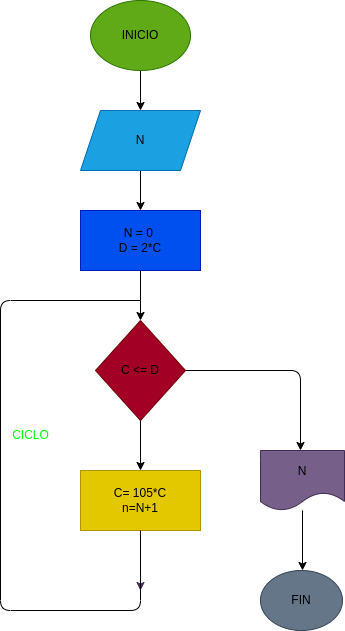

# interes_-compuesto

hacer el diagramade flujo y el programa de python, que lea un capital C, y que averigue e inprima en cuantos meses se duplica si lo colocamos a un interes compuesto del 5% mensual

# DISEÑO

# CONSTRUCCION